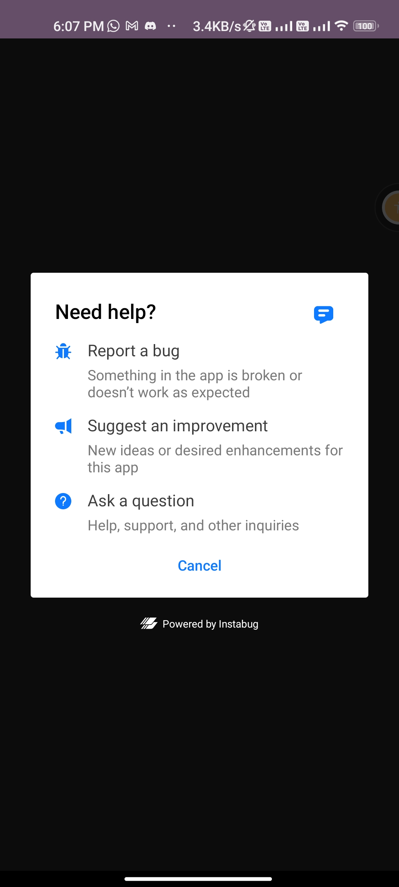
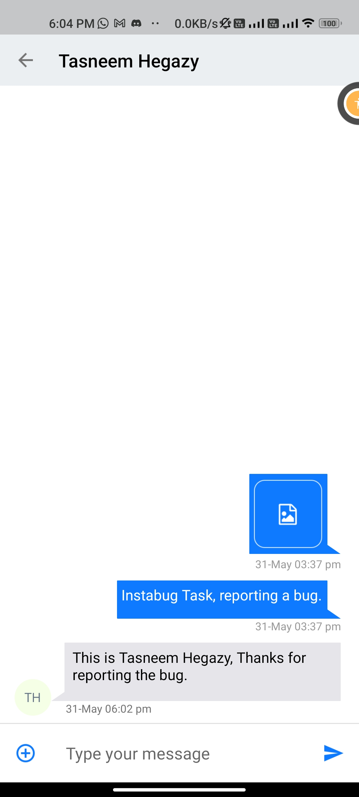

# Integrating Instabug and Utilizing some Features

## **Table of Contents**

1. [Introduction](#introduction)
2. [Bug Reporting and Feedback](#bug-reporting-and-feedback)
    - 2.1 [Steps Taken](#steps-taken-1)
    - 2.2 [How It Works](#how-it-works-1)
3. [Viewing and Responding to Chats](#viewing-and-responding-to-chats)
    - 3.1 [Steps Taken](#steps-taken-2)
    - 3.2 [How It Works](#how-it-works-2)
4. [Crash Reporting](#crash-reporting)
    - 4.1 [Steps Taken](#steps-taken-3)
    - 4.2 [How It Works](#how-it-works-3)
5. [Conclusion](#conclusion)

## 1. Introduction <a name="introduction"></a>

This document provides a comprehensive guide on how I integrated Instabug into my Kotlin app as part of the Instabug - Software Technical Support Challenge. The integration includes features such as bug reporting, feedback, viewing chats, and crash reporting. I will walk you through the integration process, explaining the steps taken and how each feature works.

## 2. Bug Reporting and Feedback <a name="bug-reporting-and-feedback"></a>

In this section, I will explain how I integrated the bug reporting and feedback feature into the app and how it functions.

### 2.1 Steps Taken <a name="steps-taken-1"></a>

To integrate bug reporting and feedback, follow these steps:

1. Add the Instabug SDK dependency: Make sure you have added the Instabug SDK dependency to your app-level `build.gradle` file. You can find the latest version of the Instabug SDK on the Instabug website or in the Instabug documentation.
2. Initialize the Instabug SDK: In your custom `Application` class or the activity where you want to use Instabug, initialize the Instabug SDK with your app token. Here's an example:

```kotlin
Instabug.Builder(this, "APP_TOKEN")
    .setInvocationEvents(
        InstabugInvocationEvent.SHAKE,
        InstabugInvocationEvent.FLOATING_BUTTON
    )
    .build()
```

Replace `"APP_TOKEN"` with your actual Instabug app token.

1. Customize the invocation events: Adjust the `setInvocationEvents()` method to specify the desired invocation events. In the example above, the SDK will be triggered either by shaking the device or by tapping on a floating button. You can choose from the available invocation events based on your requirements.
2. Build and run your app: Once you have configured the invocation events, build and run your app to test the integration. Make sure to test the specified invocation events to ensure that the Instabug SDK is triggered correctly.

By following these steps, you can customize the invocation events for the Instabug SDK in your Kotlin app. This allows you to define when and how users can access the bug reporting, feedback, or chat functionalities provided by Instabug.
.png)
.png)

### 2.2 How It Works <a name="how-it-works-1"></a>

When a user encounters a bug or wants to provide feedback, they can trigger Instabug by clicking the designated button. This action opens the Instabug bug reporting or feedback screen, depending on the selected mode. The user can then describe the issue, attach screenshots, and provide additional information. Once submitted, the bug report or feedback is sent to the Instabug dashboard for further analysis by the development team. This streamlined process enhances bug tracking and facilitates efficient communication between users and the support team.

You have the option to set one or multiple invocation events to customize when the Instabug SDK is triggered. To customize the invocation event, you can use the `setInvocationEvents()` method when initializing the Instabug SDK.

Here's an example of how you can set invocation events using the `Instabug.Builder`:

```kotlin
Instabug.Builder(this, "APP_TOKEN")
    .setInvocationEvents(
        InstabugInvocationEvent.SHAKE,
        InstabugInvocationEvent.FLOATING_BUTTON
    )
    .build()
```

In the above example, the SDK is configured to be triggered either by shaking the device or by tapping on a floating button.

Here are the possible invocation events you can choose from:

- `NONE`: No specific invocation event is set.
- `SHAKE`: The SDK is triggered when the device is shaken.
- `FLOATING_BUTTON`: A floating button is displayed on the screen, and tapping it triggers the SDK.
- `SCREENSHOT`: The SDK is triggered when the user takes a screenshot.
- `TWO_FINGER_SWIPE_LEFT`: The SDK is triggered when the user performs a two-finger swipe to the left.

You can choose one or multiple invocation events based on your preferences and the desired user experience.

## 3. Viewing and Responding to Chats <a name="viewing-and-responding-to-chats"></a>

In this section, I will explain how I integrated the chat functionality and enabled users to view and respond to chats within the app.

### 3.1 Steps Taken <a name="steps-taken-2"></a>

To show the replies page, which contains a list of any previous chats opened for a customer, you can follow these steps:

1. Ensure that you have integrated the Instabug SDK into your Kotlin app following the previous steps mentioned.
2. To display the replies page, you can use the `Replies.show()` API. Here's an example of how you can use it:

```kotlin
Replies.show()
```

1. After calling `Replies.show()`, the replies page will be displayed to the user, showing a list of any previous chats that were opened for that specific customer.

Additionally, if you want to check whether the user has any available chats before showing the replies page, you can use the `Replies.hasChats()` API. This can be useful to determine if there are any existing chats to display or if you should prompt the user to start a new chat. Here's an example:

```kotlin
if (Replies.hasChats()) {
    Replies.show()
} else {
    // Display a message or prompt the user to start a new chat
}
```

By using `Replies.hasChats()`, you can conditionally show the replies page based on whether the user has any available chats.

Make sure to import the necessary classes or packages related to Instabug before using these APIs.

.png)



### 3.2 How It Works <a name="how-it-works-2"></a>

Upon clicking the designated button, the Instabug chat interface is displayed, allowing users to access their chat conversations. Users can view previous messages and send new messages to the support team. The support team can respond to user queries and provide assistance through the Instabug dashboard. This real-time communication channel ensures efficient and effective support for users directly within the app.

## 4. Crash Reporting <a name="crash-reporting"></a>

In this section, I will cover the integration of the crash reporting feature and how it captures and reports app crashes.

### 4.1 Steps Taken <a name="steps-taken-3"></a>

To integrate manual crash reporting, follow these steps:

1. Make sure you have integrated the Instabug SDK into your app following the previous steps mentioned.
2. To manually report exceptions, use the `CrashReporting.report()` method. You can create an instance of `IBGNonFatalException` using the provided builder and pass it to the `CrashReporting.report()` method. Here's an example:

```kotlin
val exception = IBGNonFatalException.Builder(NullPointerException("Test Exception"))
    .setUserAttributes(emptyMap())
    .setFingerprint("My Custom Fingerprint")
    .setLevel(IBGNonFatalException.Level.CRITICAL)
    .build()
CrashReporting.report(exception)
```

In the example above, a `NullPointerException` is encapsulated within an `IBGNonFatalException` instance. You can customize the exception by setting user attributes, specifying a custom fingerprint, and assigning a severity level using the `setUserAttributes()`, `setFingerprint()`, and `setLevel()` methods, respectively. Finally, the exception is reported using `CrashReporting.report()`.

1. Alternatively, you can directly set the severity level for the exception without customizing other attributes. Here's an example:

```kotlin
val exception = IBGNonFatalException.Builder(NullPointerException("Test Exception"))
    .setLevel(IBGNonFatalException.Level.CRITICAL)
    .build()
CrashReporting.report(exception)
```

In this case, only the severity level is set using the `setLevel()` method before reporting the exception.

The available severity levels for manually reported exceptions are:

- `IBGNonFatalException.Level.WARNING`
- `IBGNonFatalException.Level.ERROR`
- `IBGNonFatalException.Level.CRITICAL`
- `IBGNonFatalException.Level.INFO`

*In case no level is indicated, the default level would be `ERROR`.*

Choose the appropriate level based on the severity of the exception you are reporting.

Ensure that you import the necessary classes or packages related to Instabug before using these APIs.


.png)

### 4.2 How It Works <a name="how-it-works-3"></a>

Manual crash reporting with Instabug works by allowing developers to manually report and track handled exceptions or errors in their code. When an exception occurs, developers can use it to report the exception along with relevant details. The crash report is then sent to the Instabug backend servers for analysis. 

In the Instabug dashboard, developers can view the reported exceptions, investigate their details, and debug the issues within their code. Manual crash reporting helps developers gain insights into specific exceptions, identify and resolve issues promptly, and improve the stability and performance of their apps.


## 5. Conclusion <a name="conclusion"></a>

I really enjoyed working on this challenge, and I strongly believe that Instabug plays a vital role in ensuring top companies deliver crash-free applications. I am thrilled to have the opportunity to work with one of the pioneering software companies that prioritize bug reporting, app performance monitoring, and crash reporting for mobile apps.

Tools like Instabug offer developers the ability to access symbolicated logs, which are essential for efficient bug-catching and allow developers to quickly pinpoint the exact location and cause of a bug. This feature significantly speeds up the bug-fixing process, enabling developers to resolve issues more rapidly and deliver a smoother and more reliable app experience to users.